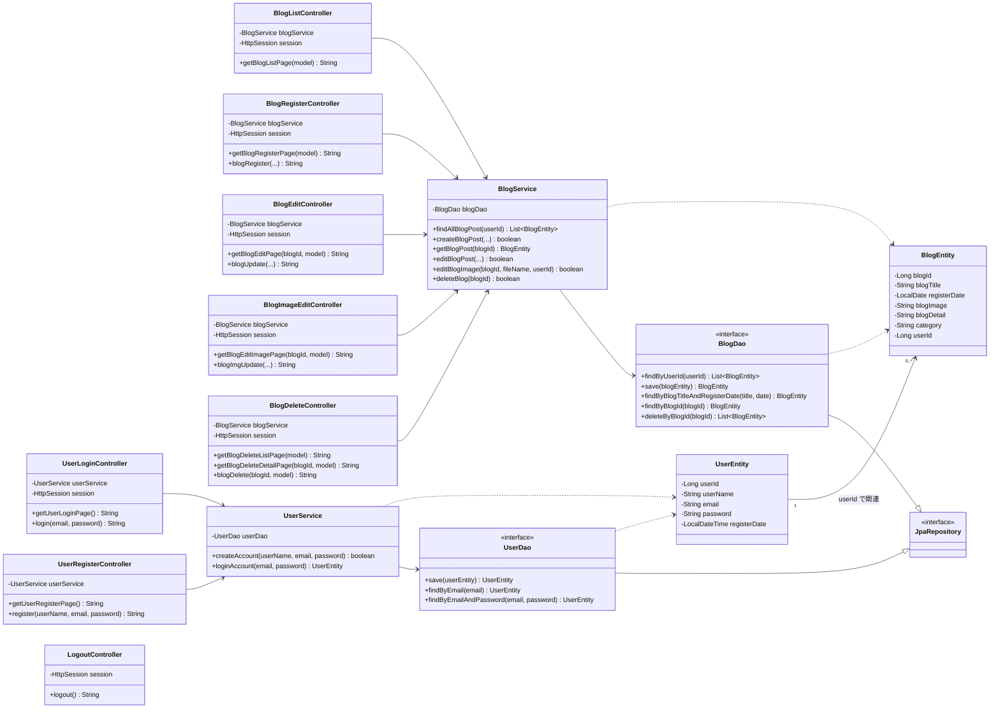

# クラス図

本アプリのクラス構成と関連を示します（Mermaid 記法）。
機能分割後のコントローラー群、サービス、DAO、エンティティの依存関係を表します。

## 1. 全体クラス図

## 2. レイヤーごとの責務

| クラス | レイヤー | 責務 |
| --- | --- | --- |
| `*Controller` | Controller | リクエスト受付・画面遷移・セッション参照 |
| `UserService` / `BlogService` | Service | 業務ロジック・判定・重複チェック |
| `UserDao` / `BlogDao` | DAO | DB アクセス（JpaRepository による自動実装） |
| `UserEntity` / `BlogEntity` | Entity | テーブルとのマッピング（Lombok でアクセサ自動生成） |

## 3. 補足

- 各 `Blog*Controller` は `BlogService` を共有して利用します（1 サービスを複数コントローラーが参照）。
- `UserDao` / `BlogDao` は `JpaRepository<Entity, Long>` を継承し、宣言したメソッドの実装は Spring Data JPA が生成します。
- `UserEntity` と `BlogEntity` は Lombok（`@Data` ほか）により getter / setter / コンストラクタが自動生成されます。
