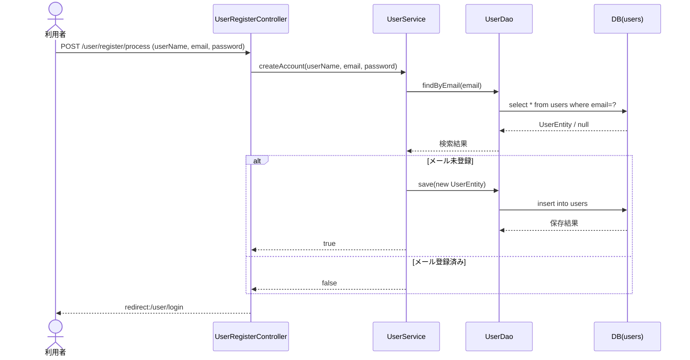
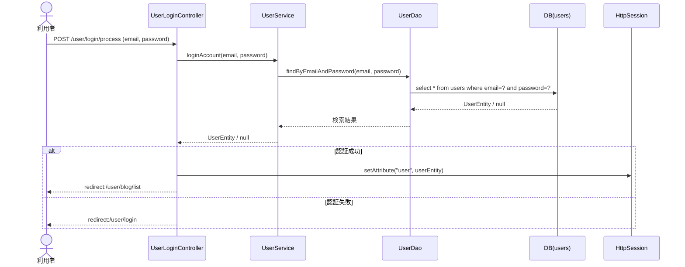
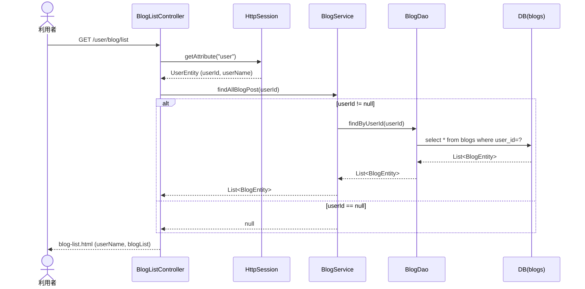
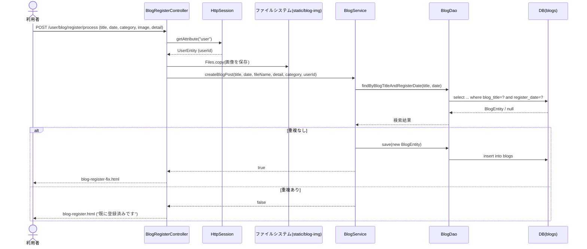
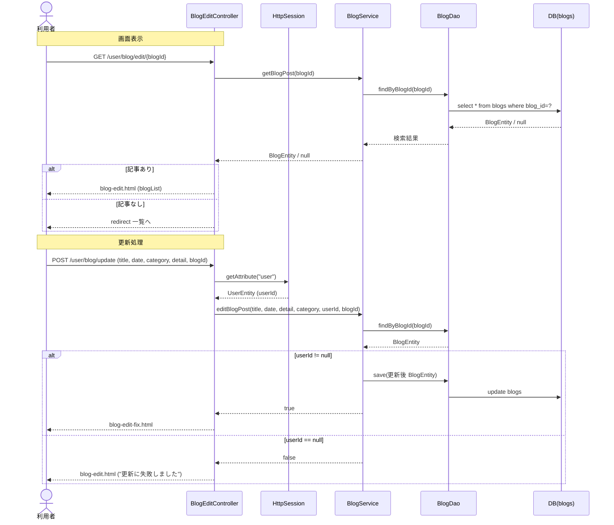
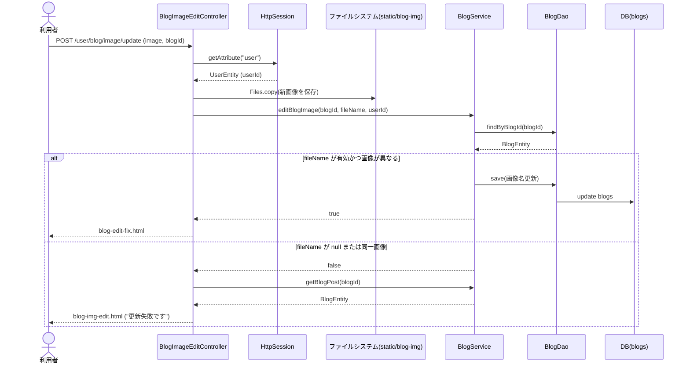
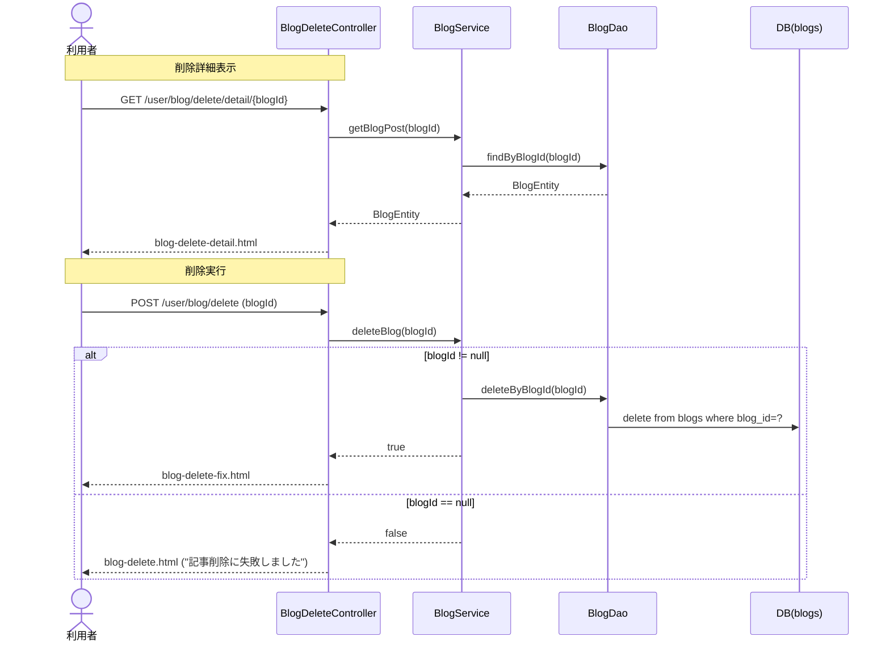
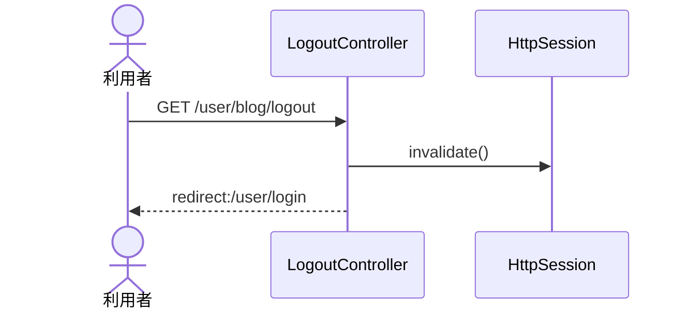

# シーケンス図

本アプリの主要な処理フローをシーケンス図（Mermaid 記法）で示します。

---

## 1. ユーザー新規登録

> 注: 登録成否に関わらずログイン画面へリダイレクトします。

---

## 2. ログイン

---

## 3. ブログ一覧表示

---

## 4. ブログ新規登録

---

## 5. ブログ記事編集（テキスト更新）

---

## 6. ブログ画像編集

---

## 7. ブログ削除

---

## 8. ログアウト

