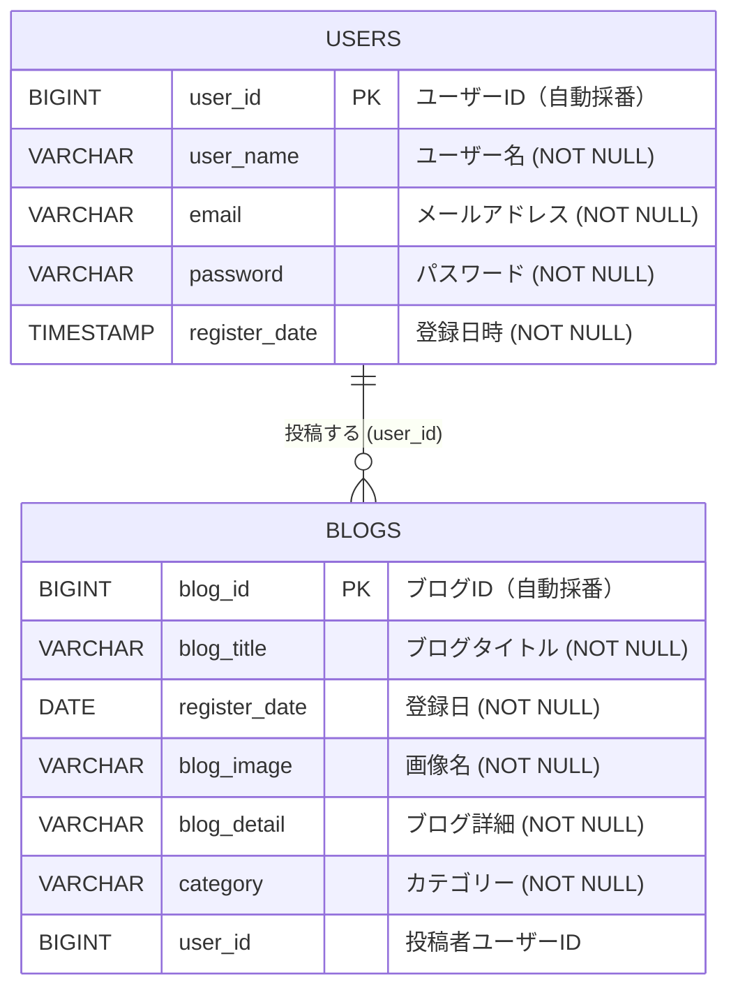

# ER図

本アプリのデータベース（blog_demo / PostgreSQL）のエンティティ関連図です（Mermaid 記法）。

## 1. ER図

## 2. リレーション

| 親 | 子 | カーディナリティ | 関連キー | 説明 |
| --- | --- | --- | --- | --- |
| USERS | BLOGS | 1 対 多（0..*） | `users.user_id` = `blogs.user_id` | 1 人のユーザーは複数のブログ記事を持つ |

## 3. 補足

- リレーションは `blogs.user_id` による**論理的な関連**です。本アプリのエンティティ（`BlogEntity`）では `user_id` をプリミティブな `Long` カラムとして保持しており、JPA の `@ManyToOne` / 外部キー制約（`FOREIGN KEY`）は定義していません。
- `users.register_date` は `TIMESTAMP`（`LocalDateTime`）、`blogs.register_date` は `DATE`（`LocalDate`）と型が異なります。
- 一意制約は JPA アノテーション上では明示されていませんが、運用上は次を一意として扱います。
  - `users.email`（登録時に重複チェック）
  - `blogs`（`blog_title` + `register_date` の組み合わせ）を新規登録時の重複チェックキーとして使用
