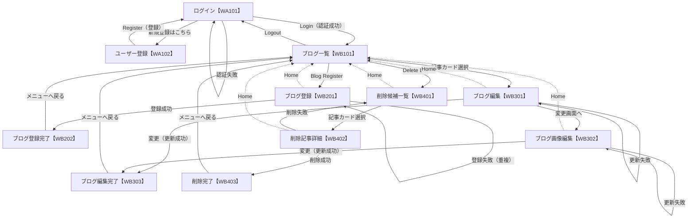
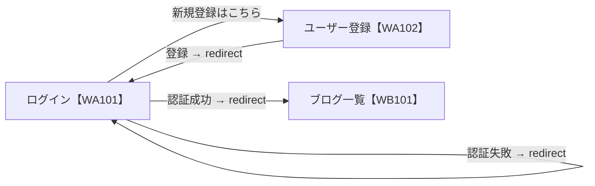
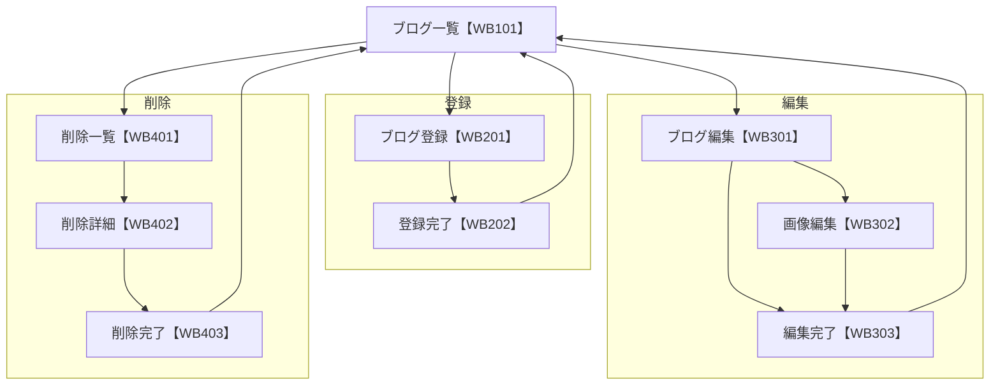

# 画面遷移図

本アプリの画面遷移を示します（Mermaid 記法）。各ノードは画面、矢印はボタン／リンク／処理結果による遷移を表します。

## 凡例

- ノード内表記: `画面名【画面ID】`
- 矢印ラベル: 操作（ボタン名・リンク名）または処理結果

---

## 1. 全体画面遷移図

> 点線は WB 系画面の共通ヘッダーナビゲーション（Home / Blog Register / Delete List / Logout）による遷移を示します（図の簡潔さのため代表として Home のみ表示）。

---

## 2. 認証フロー（A 系画面）

---

## 3. ブログ操作フロー（B 系画面）

---

## 4. 遷移一覧表

| 遷移元 | 操作 | 遷移先 | 種別 |
| --- | --- | --- | --- |
| WA101 ログイン | 新規登録はこちら | WA102 ユーザー登録 | リンク |
| WA102 ユーザー登録 | Register | WA101 ログイン | 処理（redirect） |
| WA101 ログイン | Login（認証成功） | WB101 ブログ一覧 | 処理（redirect） |
| WA101 ログイン | Login（認証失敗） | WA101 ログイン | 処理（redirect） |
| WB101 ブログ一覧 | Blog Register | WB201 ブログ登録 | リンク |
| WB101 ブログ一覧 | 記事カード選択 | WB301 ブログ編集 | リンク |
| WB101 ブログ一覧 | Delete List | WB401 削除候補一覧 | リンク |
| WB101 ブログ一覧 | Logout | WA101 ログイン | 処理（redirect） |
| WB201 ブログ登録 | 登録成功 | WB202 登録完了 | 処理 |
| WB201 ブログ登録 | 登録失敗（重複） | WB201 ブログ登録 | 処理 |
| WB202 登録完了 | メニューへ戻る | WB101 ブログ一覧 | リンク |
| WB301 ブログ編集 | 変更画面へ | WB302 画像編集 | ボタン |
| WB301 ブログ編集 | 変更（成功） | WB303 編集完了 | 処理 |
| WB301 ブログ編集 | 変更（失敗） | WB301 ブログ編集 | 処理 |
| WB302 画像編集 | 変更（成功） | WB303 編集完了 | 処理 |
| WB302 画像編集 | 変更（失敗） | WB302 画像編集 | 処理 |
| WB303 編集完了 | メニューへ戻る | WB101 ブログ一覧 | リンク |
| WB401 削除候補一覧 | 記事カード選択 | WB402 削除記事詳細 | リンク |
| WB402 削除記事詳細 | 削除（成功） | WB403 削除完了 | 処理 |
| WB402 削除記事詳細 | 削除（失敗） | WB401 削除候補一覧 | 処理 |
| WB403 削除完了 | メニューへ戻る | WB101 ブログ一覧 | リンク |
| WB201/301/302/401/402（共通ヘッダー） | Home | WB101 ブログ一覧 | リンク |
