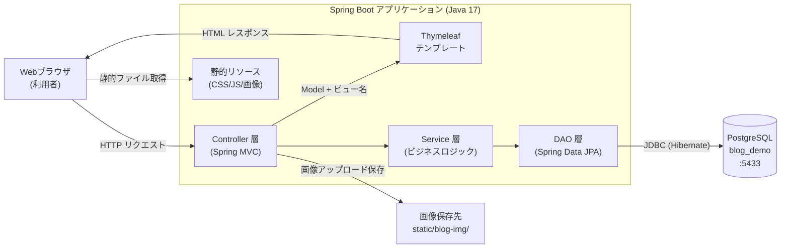
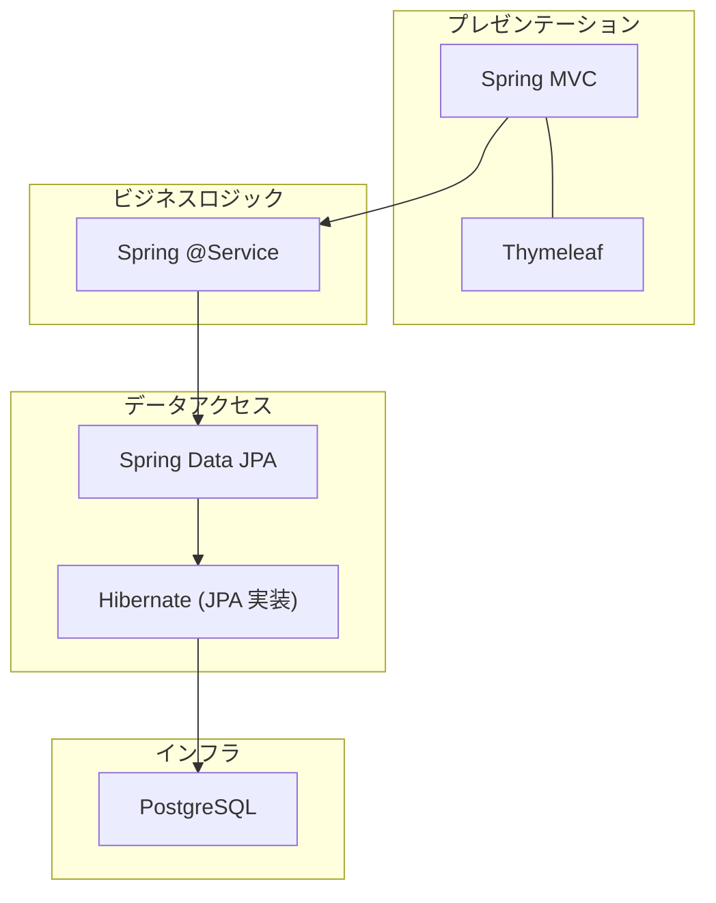
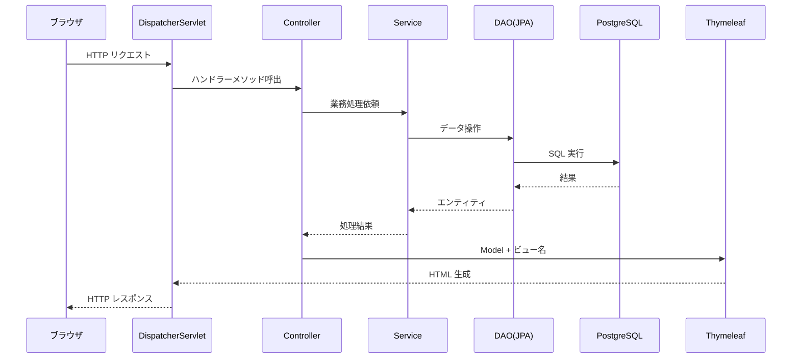

# システム構成図

| システム名 | Blog アプリケーション |
| --- | --- |

本アプリの技術構成・処理の流れ・レイヤー構成を図示します（Mermaid 記法）。

---

## 1. 全体構成図

---

## 2. 技術スタック構成

| 層 | 採用技術 | バージョン／補足 |
| --- | --- | --- |
| 言語 | Java | 17 |
| フレームワーク | Spring Boot | 3.0.4 |
| Web | Spring MVC | spring-boot-starter-web |
| ビュー | Thymeleaf | spring-boot-starter-thymeleaf |
| 永続化 | Spring Data JPA / Hibernate | spring-boot-starter-data-jpa |
| DB | PostgreSQL | localhost:5433 / blog_demo |
| 補助 | Lombok | アクセサ等の自動生成 |
| ビルド | Maven | Maven Wrapper 同梱 |
| テスト | JUnit5 / Mockito / MockMvc | spring-boot-starter-test |

---

## 3. リクエスト処理フロー（共通）

---

## 4. デプロイ／実行構成（ローカル）

| 要素 | 設定値 |
| --- | --- |
| アプリ起動ポート | 8080（Spring Boot 既定） |
| DB 接続 URL | jdbc:postgresql://localhost:5433/blog_demo |
| DB ユーザー | postgres |
| DDL 自動生成 | `spring.jpa.hibernate.ddl-auto=update` |
| 起動コマンド | `./mvnw spring-boot:run` |

> 補足: 本アプリは単一プロセス構成（組み込み Tomcat）で動作します。画像はアプリのリソースディレクトリ配下に保存されるため、運用時は外部ストレージへの分離を推奨します（[14_セキュリティ非機能設計.md](14_セキュリティ非機能設計.md) 参照）。
